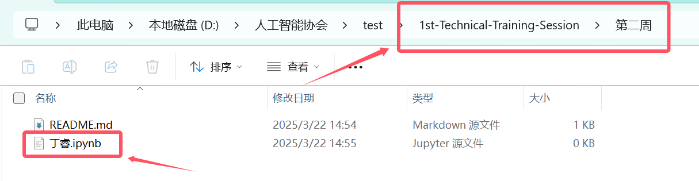

# 第二周

上传.ipynb文件，内容为[菜鸟pytorch教程](https://www.runoob.com/pytorch/pytorch-tutorial.html) （使用jupyter来跑这个教程代码），命名为自己的名字

## 上传流程

**提交第二周作业之前，请先在自己账号上创建仓库并学习git的基本操作！！**

以下操作步骤仅为简述！！

**一、Fork仓库**

**二、进入到自己账号下Fork的仓库，把仓库git到本地**

`git clone https://github.com/你的用户名/仓库名.git`

`cd 仓库名`

**三、在`第二周`目录下，添加自己的.ipynb文件作业，命名为自己的名字**

**四、创建新分支并提交**

`git checkout -b 你的分支名` 创建新分支，分支名为你名字的拼音

`git add .` 添加所有文件到暂存区

`git commit -m "描述你的更改"` 提交描述到本地仓库

`git push origin 你的分支名` 推送到远程仓库

**五、回到自己GitHub的仓库，点击 "Compare & pull request"**

**六、填写描述，点击 "Create pull request"**

